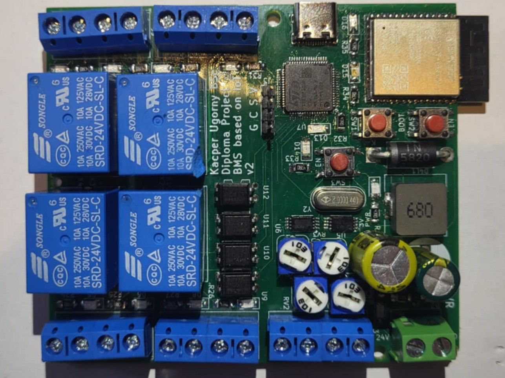

# Diploma thesis

## Building management system

### Abstract

Diploma thesis is dedicated to the creation of distributed building management system, which is fully customizable and extensible. 
Project aimed to designing and creation of end device, which uses IoT technologies, specifically MQTT communication protocol. 
Central unit of the system is single board computer Raspberry PI4, which plays role of local server. It stores data about connected devices and logical conditions. 
There are two working processes that are responsible for logic and communication with cloud server, which is responsible for redirecting messages between local server and mobile application.
The software for Android devices allows adding, editing, and deleting end devices and logical conditions. It also enables manually changing the states of outputs.

After implementation of project, tests were conducted. After analysis of results, it was determined, that the system is functioning correctly. 
Then a implementation scenario of garden control system was described.

# Technologies
- C programming language
- STM32, STM-HAL
- ESP32, ESP-IDF
- ADC, DAC, DMA
- LINUX, Pthreads
- AndroidSDK, Kotlin, Jetpack Compose
